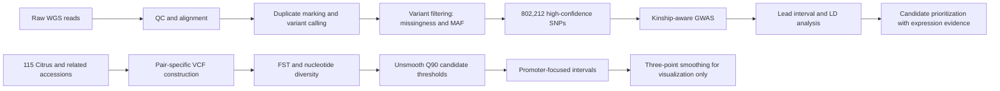

# Citrus taste-metabolite GWAS and promoter evolution

**Status:** manuscript under review  
**Authorship:** third-listed co-first author  
**My role:** computational genetics and evolutionary-genomics lead for the analyses summarized here

## Biological question

Citric acid and limonin are major sourness- and bitterness-related metabolites in citrus fruit. This project asked two connected questions:

1. Which genetic locus contributes to limonin variation in a pummelo hybrid population?
2. How did regulatory variation in the PH4-CL1 system change across Citrus and related Aurantioideae lineages?

The broader goal was to connect a fruit-quality phenotype to a candidate regulator, then test whether promoter variation and population differentiation supported an evolutionary model for metabolite divergence.

## My contribution

I independently completed the principal computational work used for genetic localization and promoter-evolution inference:

- whole-genome resequencing quality control;
- read alignment and BAM processing;
- variant calling and hard filtering;
- SNP-level population filtering;
- GWAS and kinship correction;
- candidate-region and linkage-disequilibrium analysis;
- pair-specific population construction;
- Weir-Cockerham FST and nucleotide-diversity analysis;
- promoter-focused candidate-window identification and visualization.

Experimental transformation, metabolite assays, transcriptional validation, and functional tests were conducted with collaborators.

## Data scale

| Component | Scale |
|---|---:|
| Hybrid population | 51 progeny |
| Extreme individuals used for GWAS | 23 |
| High-confidence SNPs | 802,212 |
| Natural and related accessions used for population analysis | 115 |
| Promoter scan window | 100 bp |
| Sliding step | 25 bp |

## Analysis workflow

## Key analytical result

The GWAS identified a chromosome 2 association interval for limonin accumulation. Association, LD, and expression evidence were integrated to prioritize an R3-type MYB transcription factor later designated **CL1**. Separate population-genomic analyses identified differentiation around a PH4 promoter region, providing evolutionary evidence that could be integrated with functional promoter assays conducted by collaborators.

## What this project demonstrates

This project is evidence that I can move beyond running isolated tools and instead organize a complete computational argument:

- trace data from raw sequencing through an association-ready variant set;
- match population structure control to the mapping design;
- combine mapping, LD, expression, and comparative evidence;
- distinguish exploratory visualization from statistical inference;
- communicate assumptions and limitations to experimental collaborators.

## Reproducibility status

Raw data, full scripts, and manuscript figures are not public while the manuscript is under review. This folder documents the analytical structure and decision trail without exposing collaborator-owned or unpublished materials. A sanitized workflow and small synthetic example dataset are planned after publication and collaborator approval.

- [Analysis decisions and thresholds](analysis-decisions.md)
- [Software and versions](software-versions.tsv)
